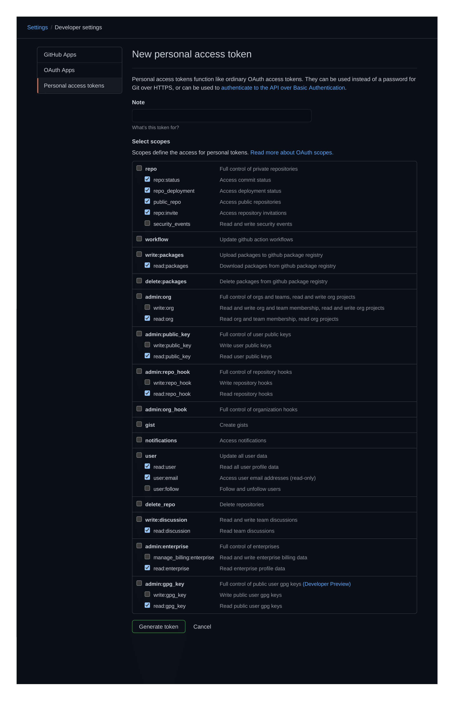

```
        ooooooooo.   ooooooooo.             oooo   o8o
        `888   `Y88. `888   `Y88.           `888   `"'
         888   .d88'  888   .d88'  .ooooo.   888  oooo   .ooooo.   .ooooo.
         888ooo88P'   888ooo88P'  d88' `88b  888  `888  d88' `"Y8 d88' `88b
         888          888`88b.    888   888  888   888  888       888ooo888
         888          888  `88b.  888   888  888   888  888   .o8 888    .o
        o888o        o888o  o888o `Y8bod8P' o888o o888o `Y8bod8P' `Y8bod8P'
        ------------ What you gonna do when they come for you -------------
```

---

# 🚨 Introduction

**PRolice** (contraction of _PR Police_) is an engineering-management tool for scrapping and measuring pull request data from GitHub repositories.

# 🚨 What is this for?

Shouting out to [SourceLevel](https://sourcelevel.io/) and their [excellent blogpost about metrics](https://sourcelevel.io/blog/5-metrics-engineering-managers-can-extract-from-pull-requests#:~:text=The%20Pull%20Request%20Flow%20Ratio,value%20to%20the%20final%20user.) (most of whose are implemented by this application):

> Many Engineering Managers promote Pull Requests as part of the development workflow. It’s a consolidated practice that brings lots of benefits. It consists of comparing the changes of a branch with the repository’s base branch (conventionally called master).
>
> Pull Requests provide useful and actionable metrics. However, following the wrong metrics cause distortions and bring more disadvantages than benefits. Managers can use pull requests metrics to understand the team dynamics and act appropriately to correct behaviors before things get out of track.
> 

**PRolice** aims to collect a sample of pull requests from a target repository and analyze them, with the objective of bringing insight into the collective project's workflow over time.

# 🚨 Forewarning

Again shouting out to [SourceLevel's blogpost](https://sourcelevel.io/blog/5-metrics-engineering-managers-can-extract-from-pull-requests#:~:text=The%20Pull%20Request%20Flow%20Ratio,value%20to%20the%20final%20user.) (seriously, read it if you haven't already):

> Before getting into the metrics, I want to make a disclaimer: **don't use these numbers to compare individuals**.
>
> Sometimes a hard-to-find bug requires a single line of code to be fixed, and that single line took a week of work. I’ve witnessed it many times in my career.
>
> I’ve also witnessed Engineering Managers encouraging developers to open pull requests with too many changes that it was unpractical to review. They usually reinforce that by telling everyone these developers are productive, that they are doing the hard job when others are taking the easiest ones.
>
> Measuring individuals through pull requests may even be unfair. A developer dedicated to maintaining a legacy codebase tends to be slower than another one, which works on a greenfield project.
>
> That’s why measuring Pull Requests is tricky. Engineering Managers can’t use pull request data to asses individuals. If you do pull requests, then you want your team to collaborate. In this practice, collaboration is the core value. Developers’ effort can’t be measured just by how many pull requests are open or merged. Even worst, effort does not represent its size. 

# 🚨 Getting into the action

## Pre-requisites

First things first, you will have to create a [personal access token](https://docs.github.com/en/github/authenticating-to-github/creating-a-personal-access-token). This is a one-time requirement and shouldn't take more than a couple of minutes.

The token will need to have read access to repositories and pull requests in order for **PRolice** to work. Something like this:



## Basic Usage

With your [personal access token](https://docs.github.com/en/github/authenticating-to-github/creating-a-personal-access-token) available, and having downloaded a binary from the [releases' section](https://github.com/DazedNConfused-/PRolice/releases), invoke **PRolice** inside your favorite terminal of choice - currently Linux and MacOS (Darwin) are supported:

```bash
prolice --owner <owner> --repository <repository> --github-token <github-token>
```

For example, if we wanted to measure [Rust's official repository](https://github.com/rust-lang/rust) metrics (_note_: this defaults to a sample of 100 PRs):

```bash
prolice --owner rust-lang --repository rust --github-token <github-token>
```

Individual PR metrics are supported too:

```bash
prolice --owner rust-lang --repository rust --pr-number 32000 --github-token <github-token>
```

## Advanced Usage

**PRolice**'s has a couple of flags and optional parameters that can be used to adjust its verbosity and sample-size:

```bash
prolice --help
```

```bash
USAGE:
    prolice [FLAGS] [OPTIONS] --owner <owner> --repository <repository> --sample-size <sample-size> --github-token <github-token>

FLAGS:
    -h, --help                 Prints help information
    -m, --include-merge-prs    Marks merge-PRs as valid targets for analysis (by default these are
                               excluded). Valid only for whole Repository analysis; for individual
                               PR analysis this flag is ignored
    -l, --print-legends        Prints the metrics' legends before sending the operation results to
                               stdout.
    -s, --silent-mode          Marks the operation as silent, which turns off all logging and
                               printing to stdout, with the sole exception of the analysis results.
                               This makes it useful for piping just the results, without the added
                               'noise'. (NOTE: piping is automatically detected, which activates
                               silent-mode without having to explicitly add the flag to the command)
    -V, --version              Prints version information

OPTIONS:
    -G, --github-token <github-token>
            Sets the personal access token under which to perform the PR analysis

    -L, --log-level <log-level>
            Overrides the logging verbosity for the whole application [default: INFO] [possible
            values: INFO, DEBUG, TRACE, WARN, ERROR, OFF]

    -O, --owner <owner>                  The owner of the repository under scrutiny
    -P, --pr-number <pr-number>
            A specific pull-request to be selected as target for the analysis.

    -R, --repository <repository>        The repository under scrutiny
    -S, --sample-size <sample-size>
            The amount of PRs that will be fetched as sample for the analysis (unless a specific PR
            number is selected as individual target) [default: 100]
```

### Notes on advanced usage

**PRolice**'s results can be piped to a file. Piping (or any absence of a TTY) is automatically detected by the application, which will turn off all logs and messages, even if the user didn't supply these flags as part of the command. This is useful for getting raw results that may be fed into another process.

For example:
```bash
prolice --owner rust-lang --repository rust --github-token <github-token> >> results.json
```

will produce a `results.json` file with the following contents (at the time of writing this readme):

```json
{
  "score": [
    {
      "AmountOfParticipants": 4
    },
    {
      "AmountOfReviewers": 1
    },
    {
      "Attachments": 1
    },
    {
      "AuthorCommentaryToChangesRatio": 31.138690476190472
    },
    {
      "PullRequestsDiscussionSize": 4065
    },
    {
      "PullRequestFlowRatio": 1.9121686296350902
    },
    {
      "PullRequestLeadTime": 1
    },
    {
      "PullRequestSize": 255
    },
    {
      "TestToCodeRatio": 0.42988095238095236
    },
    {
      "TimeToMerge": 4
    }
  ]
}
```

# 🚨 Supported metrics

What each metric "means" (aka why it is valuable to measure) can be printed as part of the analysis' results by passing the `--print-legends` flag. Still, that may pollute the terminal with excessive verbosity; so for reference, these are each metric's meaning:

### `AmountOfParticipants`

The amount of non-authoring people participating in a PR's discussion. Bigger participation may enrich discussion and produce higher quality code.

### `AmountOfReviewers`

The amount of non-authoring people that have taken a stand on a PR's outcome, either by approving or requesting for changes. This measures the amount of participants that effectively decide on a PR's fate.

### `Attachments`

Attachments can be anything ranging from added screenshots to embedded PDF files. Particularly useful for those PRs that have a visual component associated to it.

### `AuthorCommentaryToChangesRatio`

Good code should be self-explanatory; but a good PR may also include extra commentary on what it aims to achieve, how it does it and/or why it does it the chosen way.

A slim commentary may make for an ambiguous PR, shifting the burden of understanding onto the reviewer and consuming extra time from it. On the other hand, too many comments may pollute a PR with unneeded noise, to the same effect.

### `PullRequestsDiscussionSize`

Similar to Author Commentary to Changes Ratio, it measures the total amount of comments in a PR, but irrespective of who they come from. On the contrary to social media posts, too much engagement in pull requests leads to inefficiency. Measuring the number of comments and reactions for each pull request gives an idea of how the team collaborates. Collaboration is great, and its endorsement is something to be desired. However, after a certain level, discussions slow down development.

Discussions that get too big may be indicative of something wrong: maybe the team is not aligned, or maybe the software requirements are not precise enough. In any case, misalignment in discussions are not collaboration; they are a waste of time. In the opposite scenario, having almost zero engagement means code review is not part of the team's habits.

In summary, this metric must reach an 'ideal number' based on the team's size and distribution. It can't be too much, and it can't be too little either.

### `PullRequestFlowRatio`

The Pull Request Flow Ratio is the sum of the opened pull requests in a day divided by the sum of closed pull requests in that same day. This metric shows whether the team works in a healthy proportion. Merging pull requests and deploying to production is a good thing, for it adds value to the final user. However, when the team closes more pull requests than opens, soon the pull request queue starves, which means there may be a hiatus in the delivery. Ideally, it is best to make sure the team merges pull requests in a ratio as close as they open; the closer to 1:1, the better.

### `PullRequestLeadTime`

The lead-time metric gives an idea of how many times (usually in days) pull requests take to be merged or closed. To find this number, the date and time for each pull request when opened and then merged is needed. The formula is easy: a simple average for the difference of dates. Calculating this metric across all repositories in an organization can give a team a clearer idea of their dynamics.

### `PullRequestSize`

A large amount of changes per PR imposes a strain on the reviewer, who sees its attention to detail diminished the bigger a changelog gets. Ironically, developers tend to merge longer pull requests faster than shorter ones, for it is more difficult to perform thorough reviews when there are too many things going on. Regardless of how thorough the reviews are, big PRs lead to the Time To Merge going up, and the quality going down.

### `TestToCodeRatio`

As a rule of thumb, at least half of a PR should be comprised of tests whenever possible.

### `TimeToMerge`

In general, pull requests are open with some work in progress, which means that measuring Pull Request Lead Time does not tell the whole story. Time to Merge is how much time it takes for the first commit of a branch to reach the target branch. In practice, the math is simple: it is the timestamp of the oldest commit of a branch minus the timestamp of the merge commit.

The Time to Merge is usually useful while compared against the Pull Request Lead Time. Take the following example:

> * Pull Request Lead Time = 3 days
> * Time To Merge = 15 days

In the above scenario, a pull request took an average time of 3 days to be merged (which is pretty good); but the Time to Merge was 15 days. Which means that the developers worked an average of 12 days (15 – 3) before opening a pull request.
    
_NOTE:_
This metric is rendered somewhat obsolete if developers work on WIP branches before squashing all the changes into a single commit that is later used as base for the PR (this would make the Time To Merge effectively equal to the Pull Request Lead Time). However, the metric still remains incredibly useful for merge PRs (for example, merge develop into master): said PRs would have a very short Pull Request Lead Time (they don't get thorough re-reviews), but measuring against the first commit's date (Time to Merge) will tell how long it takes for features to get accumulated into a milestone worthy enough of merging into one of the 'big' branches.

--- 

# 🚨 Compiling PRolice using `cargo`

**PRolice** is written in Rust. Compiling the application for usage in the host platform is as easy as using plain-old `cargo build`:

```bash
cargo build --release
```

# 🚨 Cross-compiling PRolice using `cargo-make` (Linux to MacOS)

Lets start this section first with a little preface from [this awesome blogpost](https://medium.com/@codepitbull/cross-compilation-for-rust-and-how-to-reduce-binary-sizes-by-88-269deea50c1b):

> ### I hate Cross Compiling
> There are millions of ways to ruin the operating system you are working on and cross compiling is one of them. It normally starts with the innocent idea of getting that one build chain going you need for a small program to run on a Linksys WRT 1900 ACS (OpenWRT and ARMv7).
> 
> Digging around you find several different snippets on Reddit or some issue in a GitHub project where a random person posted a few lines of bash that look like just that missing bit of information you needed.
> 
> Running the bash can then cause one of the following things:
> * Create a working build chain (very unlikely)
> * Create a build chain which fails after 80% of your build
> * Add a local bitcoin miner while pretending to actually create a working build chain

Having felt these pains on a personal level, cross-compilation has been made available on a relatively pain-free level by the targets defined inside this project's [Cargo-makefile](https://github.com/sagiegurari/cargo-make) `cargo-makefile.toml`.

Of course, if compiling only for the host machine, sticking with plain-old `cargo build` is always the first choice. But supposing the objective was to compile from Linux to MacOS (Darwin) from scratch, in addition to the normal [Rust toolchain](https://github.com/rust-lang/rustup) you would need to install `cargo-make` as this:

```bash
cargo install --force cargo-make
```

Afterwards, compilation steps are completely taken care for you by invoking:

```bash
cargo make --makefile cargo-makefile.toml release-darwin
```

This would create and place, after the process is finished, the compressed binary at:

`<your_dir>/target/release/out/prolice_x86_64-apple-darwin.zip`


**Take into account**, however, that cross-compilation Linux-to-Darwin requires [Docker](https://www.docker.com/), so once again you may save yourself **several** MBs by sticking into building binaries for your host machine by just invoking plain old `cargo build`.